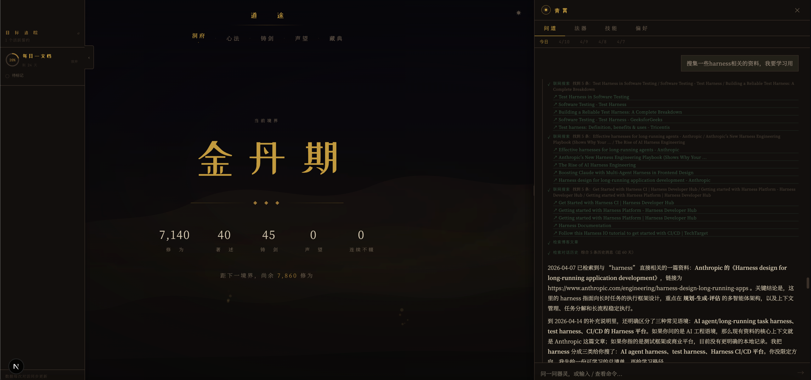

# 道途 · CodeLife

> 以修仙为皮，以成长为骨。  
> 每一篇文章是一次顿悟，每一道算法题是炼丹，每一次提交是铸剑。

把程序员日常——写作、刷题、开源——映射进修仙世界观，量化为修为，驱动境界升级。



---

## 与众不同的地方：器灵会成长

大多数 AI 助手没有记忆。每次对话都从零开始，不知道你是谁，不记得上周聊过什么。

**道途的器灵不是这样的。**

它持续观察你的修炼数据，从每一次对话中提炼认知，积累一份专属于你的记忆：你的学习节律、你反复出现的卡点、你擅长的方向、你已经整理过的技术洞察……这些都不会消失。对话越多，它越了解你。

一个月后，当你问「我最近状态怎么样」，它不会给你一个泛泛的回答，它会翻出过去 30 天的真实记录，指出你动态规划连续两周没碰，告诉你上次类似的低谷期是怎么走出来的。

它更像一个持续陪伴的伙伴，而不是一个工具。

---

## 器灵 · 青霄

点击右下角金色光点，呼唤器灵。

### 持续成长的记忆

| 层级 | 内容 | 更新方式 |
|------|------|----------|
| 今日状态 | 当日修炼摘要 + 誓约进度 | 每次对话自动注入 |
| 每日日志 | 各类活动的完整记录 | 每日同步时生成 |
| 周规律 | AI 归纳的修炼模式与隐患 | 每周一自动生成 |
| 人格档案 | 长期观察到的偏好与习惯 | 每 7 天更新 |
| 偏好画像 | 从对话提炼的行为特征（置信度加权） | 对话中持续积累 |
| 技能卡 | 从深度技术对话提炼的完整 Markdown 文档 | 每次深度对话后 |

这六层记忆在每次对话前自动注入系统提示——器灵开口就已经知道你是谁，最近在做什么，上次聊到哪里。

### 不止于聊天

器灵能主动获取信息、操作数据，而不只是回答问题：

**读取你的数据** — 博客文章、刷题记录、修为统计、历史对话语义检索

**联网** — Tavily 搜索、任意 URL 正文抓取

**操作文件与命令** — 目录浏览、文件读写、shell 执行（三级安全分级，危险操作弹出确认）

**写操作（需确认）** — 收藏文章到藏经阁、创建/更新誓约、记录技术洞察

**MCP 扩展** — `/install` 命令在运行时动态装载任意 MCP 工具包

### 自适应多 Agent 架构

基于 LangGraph 实现，根据任务复杂度自动选择执行策略：

```
用户输入
    │
    ▼
[快速分类器]  ← 纯规则，毫秒级，无额外 LLM 调用
    │
    ├─→ 直通（默认）──────────────────────────→ 青霄直接回答（支持多轮工具调用）
    │
    ├─→ 串行调度 ──→ 青霄制定计划
    │                 ├─→ 搜寻使（web_search / fetch_url）
    │                 ├─→ 算法师（刷题 / 博客数据）
    │                 └─→ 星盘官（修炼状态分析）
    │                         └──────────────→ 青霄整合回答
    │
    └─→ 并行 ────────→ 多 Agent 同时执行 ────→ 合并器汇总
```

### Shell 安全分级

| 级别 | 示例 | 处理方式 |
|------|------|----------|
| 安全 | `ls`、`cat`、`git status` | 直接执行 |
| 中危 | `git commit`、`npm install`、文件写入 | 弹出确认，可选「本次会话允许」 |
| 高危 | `rm -rf`、`sudo`、`kill` | 弹出确认，标注高危 |

### 快捷命令

| 命令 | 说明 |
|------|------|
| `/观心` | 分析近期修炼状态，指出规律与隐患 |
| `/指路` | 根据当前状态推荐今日应做什么 |
| `/立誓` | 向器灵立下可自动核验的目标 |
| `/炼心` | 从当前对话提炼技能卡，永久保存 |
| `/藏经` | 粘贴 URL，自动抓取收藏到藏经阁 |
| `/寻典` | 自然语言检索藏经阁 |
| `/此页` | 将当前页面内容注入对话上下文 |
| `/install <包名>` | 动态装载 MCP 工具包 |

---

## 其他功能

### 修为体系

所有学习行为自动量化，修为积累驱动境界升级（炼气 → 筑基 → 金丹 → … → 飞升，共 10 级）。

| 行为 | 修为 |
|------|------|
| 博客 500-2000 字 | +80 |
| 博客 2000+ 字 | +200 |
| LeetCode Easy / Medium / Hard | +30 / +80 / +200 |
| GitHub Commit | +15 |
| 连续打卡 7 天 / 30 天 | +500 / +3000 |

权重可在 `codelife.config.ts` 中自由调整。

### 数据来源

- **博客**：Notion Database / Ghost CMS / 本地 Markdown，三选一
- **刷题**：力扣中文版（Cookie 自动拉取）、国际版、手动 YAML
- **GitHub**：GraphQL 拉取 commit 记录与仓库数据

### 藏经阁

收藏技术文章，自动抓取正文生成摘要，本地向量索引。BM25 关键词 + 语义向量 RRF 融合检索。

### 功法台

从博客分类、刷题记录中推导技能依赖关系，生成可交互的力导图。

### 誓约系统

向器灵立下可验证的目标（如「连续 30 天每日刷题」），器灵每日自动核验进度。

---

## 快速开始

### 1. 安装依赖

```bash
npm install
```

### 2. 配置环境变量

```bash
cp .env.local.example .env.local
```

| 变量 | 用途 | 必填 |
|------|------|------|
| `SPIRIT_API_KEY` | 器灵 AI 的 API Key（OpenAI 兼容） | 使用器灵时 |
| `SPIRIT_BASE_URL` | 自定义端点（DeepSeek / Ollama 等） | 可选 |
| `SPIRIT_MODEL` | 模型名称（默认 `gpt-4o-mini`） | 可选 |
| `NOTION_TOKEN` | Notion Integration Token | 使用 Notion 博客时 |
| `NOTION_DATABASE_ID` | Notion 博客数据库 ID | 使用 Notion 博客时 |
| `GITHUB_TOKEN` | GitHub Personal Access Token | 展示 GitHub 数据时 |
| `TAVILY_API_KEY` | 联网搜索（tavily.com） | 器灵联网搜索时 |
| `LEETCODE_CN_COOKIE` | `LEETCODE_SESSION=xxx; csrftoken=yyy` | cn 模式时 |
| `SYNC_SECRET` | `/api/sync` 鉴权密钥 | 生产环境定时触发时 |

### 3. 修改配置

编辑 `codelife.config.ts`：

```typescript
site: {
  author: '你的名字',
  url:    'https://yourdomain.dev',
},
github:  { username: 'your-github-username' },
leetcode: {
  provider: 'cn',           // 'cn' | 'manual' | 'unofficial'
  username: 'your-username',
},
spirit: {
  name:         '青霄',
  model:        'gpt-4o-mini',
  reflectModel: 'gpt-4o',   // 记忆提炼用，不填则复用 model
}
```

### 4. 启动

```bash
npm run dev   # 默认端口 3002
```

---

## 配置说明

### 博客数据源

| provider | 说明 | 所需变量 |
|----------|------|---------|
| `local` | `content/posts/` 下的 `.md` / `.mdx` | 无 |
| `notion` | Notion Database | `NOTION_TOKEN`, `NOTION_DATABASE_ID` |
| `ghost` | Ghost CMS | `GHOST_URL`, `GHOST_CONTENT_API_KEY` |

### LeetCode 数据源

| provider | 说明 |
|----------|------|
| `cn` | 力扣中文版，Cookie 自动拉取（推荐国内） |
| `unofficial` | 国际版 GraphQL |
| `manual` | 手动维护 `content/leetcode.yaml` |

**cn 模式**：浏览器登录 leetcode.cn → F12 → Application → Cookies，复制 `LEETCODE_SESSION` 和 `csrftoken` 填入 `.env.local`。

### 数据同步

| 任务 | 触发方式 | 产物 |
|------|----------|------|
| 今日日志 | 每次对话自动触发 | `content/spirit/logs/{date}.json` |
| 周规律分析 | 每周一 / 手动 POST `/api/spirit/sync` | `content/spirit/patterns/{week}.json` |
| 人格档案更新 | 每 7 天 / 手动 | `content/spirit/persona.json` |
| 技能卡提炼 | 有未处理对话时 / 手动 POST `/api/spirit/skills` | `content/spirit/skills/` |
| 偏好画像提炼 | 有未处理对话时 / 手动 POST `/api/spirit/preferences` | `content/spirit/preferences.json` |

---

## 境界体系

| 境界 | 所需修为 |
|------|---------|
| 炼气期·一重 | 0 |
| 炼气期·九重 | 500 |
| 筑基期 | 1,500 |
| 金丹期 | 5,000 |
| 元婴期 | 15,000 |
| 化神期 | 40,000 |
| 炼虚期 | 100,000 |
| 合体期 | 250,000 |
| 大乘期 | 600,000 |
| 渡劫·飞升 | 1,000,000 |

---

## 技术栈

| 类别 | 技术 |
|------|------|
| 框架 | Next.js 16 (App Router) |
| 语言 | TypeScript 5 |
| AI 编排 | LangGraph.js + LangChain |
| 数据验证 | Zod |
| 博客内容 | Notion / Ghost / MDX |
| 混合检索 | MiniSearch (BM25) + OpenAI Embeddings (RRF 融合) |
| 数据来源 | GitHub API · LeetCode GraphQL |
| MCP 扩展 | @modelcontextprotocol/sdk |
| 部署 | Vercel（推荐） |

---

## 项目结构

```
CodeLife/
├── codelife.config.ts            主配置文件
├── content/
│   ├── posts/                    本地博客
│   ├── leetcode.yaml             LeetCode 手动数据
│   └── spirit/                   器灵持久化数据
│       ├── logs/                 每日修炼日志
│       ├── patterns/             每周规律分析
│       ├── conversations/        对话历史
│       ├── summaries/            对话摘要
│       ├── skills/               技能卡（完整 Markdown 文档）
│       ├── library/              藏经阁
│       ├── persona.json          人格档案
│       ├── vows.json             誓约记录
│       └── preferences.json      偏好画像
└── src/
    ├── app/
    │   └── api/spirit/           器灵 API（chat / session / skills / preferences / vows …）
    ├── components/
    │   └── spirit/
    │       ├── SpiritWidget.tsx  器灵面板（问道 / 法器 / 技能 / 偏好 四 Tab）
    │       ├── MessageItem.tsx   消息渲染
    │       ├── useSpiritChat.ts  对话状态 Hook
    │       └── types.ts          共享类型 + 斜杠命令
    └── lib/spirit/
        ├── langgraph/            多 Agent 编排
        ├── tools/                内置工具（按域分组）
        ├── memory.ts             六层记忆读写
        ├── prompt.ts             System Prompt 构建
        ├── skill-extractor.ts    技能卡提炼
        └── preference-extractor.ts  偏好画像提炼
```

---

## 部署

```bash
npm run build
```

推荐 Vercel 一键部署，在项目设置中添加 `.env.local` 中的所有环境变量即可。
